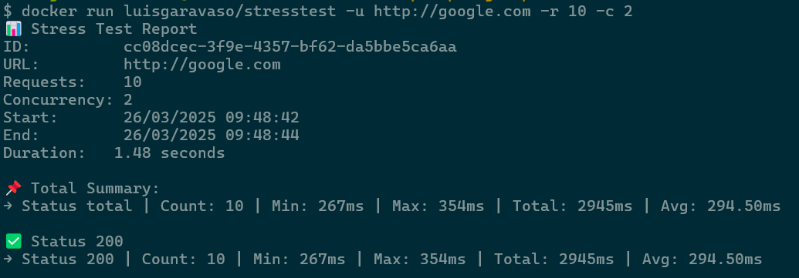
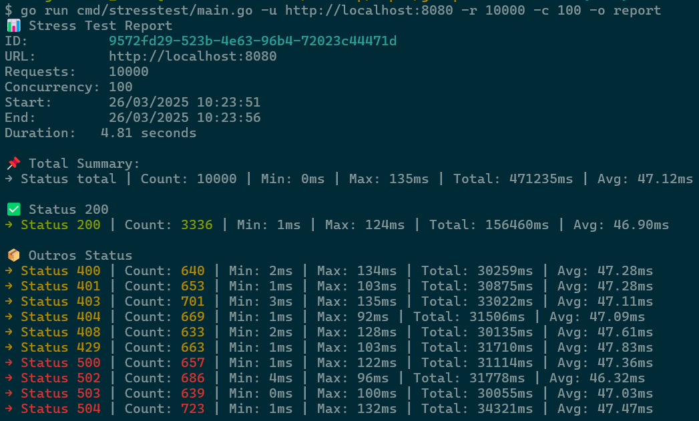

# 📦 Stress Test CLI - Desafio em Go

Este projeto é um sistema de linha de comando desenvolvido em [Go](https://golang.org/) para executar testes de carga em serviços web. Com ele, você pode configurar a URL do serviço, o número total de requisições e a quantidade de chamadas simultâneas. Ao final, um relatório completo é gerado, disponível em **JSON** ou **Markdown**.

A aplicação foi construída com foco em simplicidade, performance e facilidade de execução — tanto via terminal quanto com Docker.

---

## 🚀 Funcionalidades

- Realiza testes de carga em qualquer endpoint HTTP.
- Interface de terminal intuitiva utilizando [Cobra CLI](https://github.com/spf13/cobra).
- Controla:
  - Número total de requisições
  - Grau de concorrência
- Gera relatórios com:
  - Tempo total da execução
  - Total de requisições realizadas
  - Quantidade de respostas HTTP 200
  - Distribuição dos demais códigos HTTP (404, 500 etc.)
- Exporta o relatório em formato **JSON** ou **Markdown**.

---

## 📥 Como Usar

### 1. Executando com Docker

A forma mais prática de rodar o Stress Test é com a imagem disponível no [DockerHub](https://hub.docker.com/r/luisgaravaso/stresstest):

#### Versão completa:
```bash
docker run luisgaravaso/stresstest --url http://google.com --requests 10 --concurrency 2
```

#### Versão abreviada:
```bash
docker run luisgaravaso/stresstest -u http://google.com -r 10 -c 2
```

### 2. Executando localmente

#### 2.1 Clone o repositório
```bash
git clone https://github.com/seu-usuario/stresstest.git
cd stresstest
```

#### 2.2 Execute o teste de carga
```bash
go run cmd/stresstest/main.go --url http://google.com --requests 10 --concurrency 2
```

### 3. Resultado

> Você verá um resultado como:



---

### 3. Parâmetros da CLI

| Flag                 | Descrição                                                                 | Exemplo                     |
|----------------------|--------------------------------------------------------------------------|-----------------------------|
| `-u`, `--url`        | URL do serviço a ser testado **(Obrigatório)**                           | `http://google.com`         |
| `-r`, `--requests`   | Número total de requisições a serem enviadas                             | `10`                        |
| `-c`, `--concurrency`| Número de chamadas simultâneas                                           | `2`                         |
| `-o`, `--output`     | Nome do arquivo de saída (sem extensão)                                  | `report`                    |
| `-s`, `--showdata`   | Salva cada requisição no relatório JSON detalhado                        | `-s` (não requer valor)     |

---

### 3.1 Salvando os dados localmente com Docker

1. Execute o container com nome e flag de output:
```bash
docker run --name meu-container luisgaravaso/stresstest --url http://google.com --requests 10 --concurrency 2 --output report
```

2. Copie os arquivos gerados para o seu sistema:
```bash
docker cp meu-container:./report.json ./report.json
docker cp meu-container:./report.md ./report.md
```

> 💡 Lembre-se: Utilize a flag `-s` para incluir os dados individuais de cada requisição.

---

## Relatório

#### 📊 Stress Test Report
**ID:** 9572fd29-523b-4e63-96b4-72023c44471d
**URL:** http://localhost:8080
**Requests:** 10000
**Concurrency:** 100
**Start:** 26/03/2025 10:23:51
**End:** 26/03/2025 10:23:56
**Duration:** 4.81 seconds

##### 📌 Total Summary
| Count | Min Time | Max Time | Total Time | Average Time |
|-------|----------|----------|------------|---------------|
| 10000 | 0ms | 135ms | 471235ms | 47.12ms |

##### ✅ Status 200
| Count | Min Time | Max Time | Total Time | Average Time |
|-------|----------|----------|------------|---------------|
| 3336 | 1ms | 124ms | 156460ms | 46.90ms |

##### 📦 Outros Status
| Status | Count | Min Time | Max Time | Total Time | Average Time |
|--------|-------|----------|----------|------------|---------------|
| 400 | 640 | 2ms | 134ms | 30259ms | 47.28ms |
| 401 | 653 | 1ms | 103ms | 30875ms | 47.28ms |
| 403 | 701 | 3ms | 135ms | 33022ms | 47.11ms |
| 404 | 669 | 1ms | 92ms | 31506ms | 47.09ms |
| 408 | 633 | 2ms | 128ms | 30135ms | 47.61ms |
| 429 | 663 | 1ms | 103ms | 31710ms | 47.83ms |
| 500 | 657 | 1ms | 122ms | 31114ms | 47.36ms |
| 502 | 686 | 4ms | 96ms | 31778ms | 46.32ms |
| 503 | 639 | 0ms | 100ms | 30055ms | 47.03ms |
| 504 | 723 | 1ms | 132ms | 34321ms | 47.47ms |

---

## 📂 Estrutura do Projeto

```
root/
├── cmd/stresstest/           # Ponto de entrada da aplicação
│   └── main.go               # Inicializa a CLI
├── internal/
│   ├── entity/               # Entidades de domínio
│   ├── presenters/           # Conversão para output: JSON, Markdown, terminal
│   ├── usecase/run/          # Caso de uso principal para execução do teste
│   └── repository/           # Interface para repositórios (mockado)
├── mocks/repository/         # Mock do repositório para testes
├── tests/main.go             # Script para servidor HTTP fake local
```

> ℹ️ O servidor fake na pasta `tests/` não é um teste automatizado. Ele responde com diferentes códigos HTTP para simular um cenário real e gerar relatórios completos.

---

## 🧪 Testes

### ✅ Unitários
Validam a lógica das entidades:
- Verificação dos parâmetros (URL, requests, concorrência)

Arquivo: `internal/entity/entity_test.go`

### 🔁 Integração
Testam a integração entre Usecase e Repositório Mock:
- Verificam se os dados para relatório estão corretos

Arquivo: `internal/usecase/run/run_test.go`

### 🧪 E2E (Manual)
Um servidor de testes pode ser iniciado com:

1. Suba o servidor fake:
```bash
go run tests/main.go
```

2. Em outro terminal, execute:
```bash
go run cmd/stresstest/main.go -u http://localhost:8080 -r 10000 -c 100
```

> Exemplo de resultado:


---

## 🔧 Tecnologias Utilizadas

- [Golang](https://golang.org/)
- [Cobra CLI](https://github.com/spf13/cobra)
- [Docker](https://www.docker.com/)
- [Testify](https://github.com/stretchr/testify) para testes
